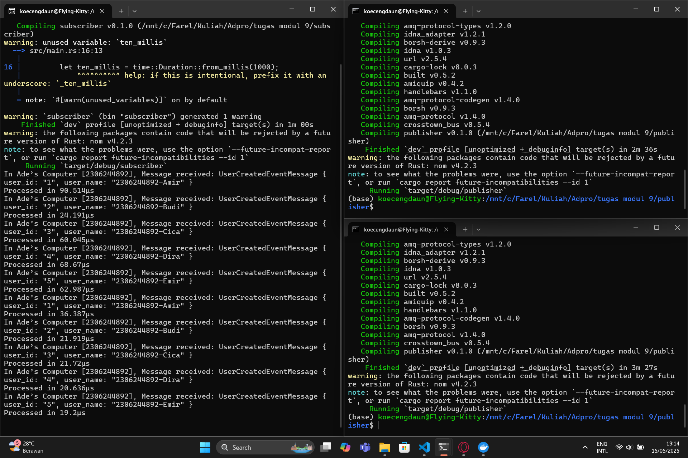

## **a. Apa itu AMQP?**

AMQP (Advanced Message Queuing Protocol) adalah protokol terbuka untuk pertukaran pesan di aplikasi. Dengan AMQP, satu sistem (producer) mengirim pesan ke broker (misalnya RabbitMQ), lalu sistem lain (consumer) mengambil dan memproses pesan itu—tanpa perlu tahu detail implementasi masing-masing.

## **b. Penjelasan `guest:guest@localhost:5672`**

Format umumnya:

```
username:password@host:port
```

* **`guest` (pertama)**: nama pengguna (username) untuk masuk ke broker AMQP.
* **`guest` (kedua)**: kata sandi (password) dari pengguna tersebut.
* **`localhost`**: alamat server broker—di sini artinya komputer lokal Anda.
* **`5672`**: nomor port TCP di mana broker mendengarkan koneksi AMQP (standar AMQP).

## Gambar

### 1. Membuka Rabbit MQ


### 2. Mengirim dan prosesing

#### Hal yang terjadi
Gambar tersebut menunjukkan alur publish-subscribe antara dua program Rust (publisher dan subscriber) yang berjalan di WSL:

1. **Publisher Mengirim Event**

   * Begitu `target/debug/publisher` dijalankan, ia mem-publish lima pesan `UserCreatedEventMessage` ke queue `user_created` (tanpa log output khusus di screenshot, karena `publish_event` dipanggil tanpa `println!`).

2. **Subscriber Menerima & Memproses**

   * Terminal kiri: `target/debug/subscriber` menerima setiap event dari RabbitMQ.
   * Setiap kali pesan masuk, subscriber menampilkan:

     ```
     In Ade’s Computer [2306244892], Message received: UserCreatedEventMessage { user_id: "1", user_name: "2306244892-Amir" }
     Processed in 36.387µs
     ```
   * Karena delay 1 detik (`thread::sleep`) dikomentari, waktu proses yang tercatat hanya puluhan mikro-detik.
